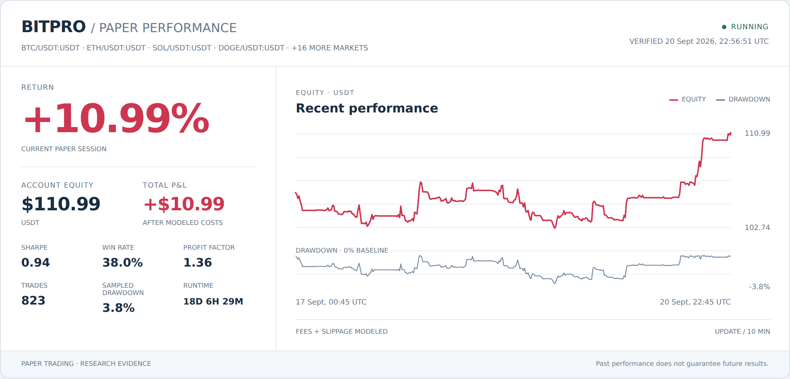

  <strong>English</strong> |
  <a href="README_CN.md">简体中文</a>

# Jie Feng

**Big Data Engineer · AI Agent & Quant Systems Researcher**

My primary profession is big-data development, backed by **9 years of production big-data
engineering experience** across PB-scale offline data warehouses, large-scale streaming,
workflow governance, data quality, and performance optimization.

Outside my primary role, I continuously research **AI Agents, quantitative systems, and end-to-end
AI products**. I explore how models can work with real data and tools, then add durable state,
evidence, evaluation, permissions, human approval, and runtime verification so the systems can be
iterated responsibly.

**Markets I know: perpetual futures and Chinese A-shares. Perpetual futures are my main quantitative research focus**, connecting data engineering with market-data processing, strategy validation, Paper trading, and risk monitoring.

## Primary Career | Big Data Engineering

| Core area | Capability scope |
| --- | --- |
| **Offline data warehousing** | Dimensional and layered modeling, shared layers, metric consistency, cross-region synchronization, and backfills |
| **Streaming systems** | Flink/Kafka pipelines, large-state checkpoints, throughput and latency tuning, and failure recovery |
| **Workflow governance** | Dependencies, resources, staged rollouts, SLAs, backfills, migration, and observability |
| **Data quality** | Real-data validation, lineage and audit, anomaly diagnosis, reproducible computation, and reliability governance |

Core stack: `Flink` · `Kafka` · `Spark` · `Hive` · `Hadoop` · `HBase` · `Airflow` ·
`MySQL` · `PostgreSQL` · `ClickHouse` · `Python` · `Java` · `Scala`

## Ongoing Side Research | AI Agents, Quant, and AI Products

| Research direction | Current work |
| --- | --- |
| **Perpetual Futures Research · Primary Quant Focus** | Long/short strategies, exchange data, backtesting, and Paper validation; studying the effects of leverage, margin, funding rates, fees, and slippage |
| **Chinese A-share Research** | Market data and data quality, stock selection and strategy research, reproducible backtesting, Paper trading, and market monitoring |
| **AI Agents & Autonomous Research** | Governed runtimes, tool orchestration, persistent goals and evidence, program synthesis, evaluation, and recovery |
| **AI Products & Operations** | AI video production, GPU/model integration, content operations, human review, testing, deployment, and observability |

These tracks remain active research and ongoing iteration. I distinguish local validation, research
experiments, Paper sessions, competition results, and production outcomes instead of presenting
process states as verified achievements.

## Selected Outcomes & Capability Evidence

### Big Data Engineering Outcomes

| Scale | Engineering outcome |
| --- | --- |
| **600+ TB/day** | Production data paths serving analytics across 10 international sites |
| **1000+ jobs** | Dependency, resource, rollout, SLA, backfill, and recovery governance during scheduler migration |
| **10B events/day** | Real-time warehouse path built with Flink, Kafka, MySQL, and HBase |
| **PB-scale DWH** | Layered modeling, shared data layers, metric consistency, cross-region synchronization, and data quality |

### AI Agent Research Systems

#### [HyperTrade](https://github.com/Shadowell/HyperTrade)

A governed quantitative-research Agent runtime that turns open-ended research goals into durable,
reviewable missions.

- Persists goals, plans, steps, evidence, budgets, and completion conditions
- Combines MCTS and MAP-Elites for diverse strategy-code exploration
- Uses red-team stress tests, regime attribution, and structured negative constraints
- Keeps research, backtesting, Paper trading, and real effects behind explicit control boundaries

#### [HyperARC](https://arcprize.org/competitions/2026) · Private Research

**Competitions:** [ARC-AGI-2](https://www.kaggle.com/competitions/arc-prize-2026-arc-agi-2) ·
[ARC-AGI-3](https://www.kaggle.com/competitions/arc-prize-2026-arc-agi-3)

An ARC-AGI research system spanning ARC-AGI-1/2 program synthesis and ARC-AGI-3 interactive-Agent
experiments.

- Grid-transformation DSLs, candidate generation, exact-match validation, and restricted code execution
- Visual-state abstraction, action history, skill routing, and trajectory-based evaluation
- Separates local diagnostics from official benchmark results and retains reproducible evidence

Agent engineering capabilities: `Planning` · `Tool Calling` · `MCP` · `JSON Schema` ·
`State Machines` · `Memory` · `Evaluation` · `Human Approval` · `Recovery` · `Audit`

### Kaggle Competition Research

Public leaderboard snapshot as of **15 September 2026, 17:48 (UTC+8)**. All four competitions are ongoing. Rankings use “current rank / total leaderboard teams” and may change.

| Competition | Team | Rank / Total teams | Leaderboard score | Status |
| --- | --- | ---: | ---: | --- |
| [ARC-AGI-2](https://www.kaggle.com/competitions/arc-prize-2026-arc-agi-2/leaderboard) | HyperARC | 542 / 2027 | 30.56 | Ongoing |
| [ARC-AGI-3](https://www.kaggle.com/competitions/arc-prize-2026-arc-agi-3/leaderboard) | HyperARC | 2103 / 3056 | 0.17 | Ongoing |
| [RSNA Knee Abnormality Detection](https://www.kaggle.com/competitions/rsna-knee-abnormality-detection/leaderboard) | Shadowell888 | 389 / 3773 | 0.941 | Ongoing |
| [Kaggriculture](https://www.kaggle.com/competitions/kaggriculture/leaderboard) | Shadowell888 | 1557 / 9101 | 2001.2 | Ongoing |

- **[RSNA Knee Abnormality Detection](https://www.kaggle.com/competitions/rsna-knee-abnormality-detection)** — An ongoing medical-imaging competition focused on multimodal knee abnormality detection using MRI scans and radiology reports.
- **[Kaggriculture](https://www.kaggle.com/competitions/kaggriculture)** — An ongoing farming strategy competition focused on resource allocation, market decisions, and agent strategy evaluation.

### Quantitative Research | Perpetual Futures & Chinese A-shares

**Perpetual futures are my main quantitative research focus; Chinese A-shares are another familiar market I continue to research.**

- **BitPro · Private Product** — Digital-asset research platform focused on **perpetual futures research and Paper trading**, covering exchange data, long/short strategies, strategy versions, asynchronous backtests, Paper validation, controlled execution, and monitoring

  **Strategy running live**: Top20 microstructure long/short breakout with pyramiding. The chart below shows **Paper validation performance**. Verified live results for 15 September 2026, as of 17:41 (UTC+8): **+2.12% / +$2.37**, including the change in attributed unrealized PnL.

   
  Paper performance snapshot · scheduled every 10 minutes (scheduling and image caching may delay updates) · click for the dynamic dashboard

I treat market-data quality, reproducible computation, costs, fills, and audit trails as prerequisites.
Strategy research is presented as research evidence—not as unverified return claims.

**Chinese A-share research and engineering:**

- [Alpha](https://github.com/Shadowell/Alpha) — Open-source A-share research system with trusted market-data ingestion, reproducible workflows, CI, and a public release
- [StockPro](https://github.com/Shadowell/StockPro) — Real-time A-share research and monitoring platform with data quality, strategy lifecycle, backtesting, Paper trading, and operational checks
- [QuantBase](https://github.com/Shadowell/QuantBase) — Research workbench for real market data, Backtrader validation, Paper trading, signal audit, and risk-first development

### AI Products & Independent Products

- **Zora · Private Product** — AI animation workspace connecting story, characters, storyboards, video generation, voice, composition, quality review, and publishing
- **FrameLab · Private Product** — AI video platform integrating model APIs, ComfyUI/GPU workers, asynchronous jobs, storage, credits, moderation, testing, and deployment

I use Codex, Cursor, GLM, Grok, and other models according to their capabilities and limits. I remain
responsible for business judgment, requirement decomposition, constraints, acceptance criteria,
and verification through real data, automated tests, runtime logs, and user-visible outcomes.

#### Independently Operated WeChat Products

##### 配料君

A food-ingredient analysis and health-literacy mini program that I continuously operate and improve,
covering data organization, product iteration, and promotion through WeChat Search.

##### 野钓潮汐

A fishing-focused tide and weather mini program integrating time-series tide and weather data,
backend services, and a mobile-facing product experience.

Both products are continuously operated and iterated—not one-off demos.

> Employer source code, business data, and internal implementation details remain confidential.
> Private projects are described by capability and verified outcomes without exposing their repositories.

## Current Focus

- Reliable batch, streaming, and data-governance systems, including data foundations for model and Agent workloads
- Governed Agent runtimes with evidence, evaluation, memory, and safe tool use
- Perpetual futures long/short strategies, costs, and risk, alongside A-share strategy and data research using real data and Paper validation
- AI video and content-production systems with human review and observable delivery
