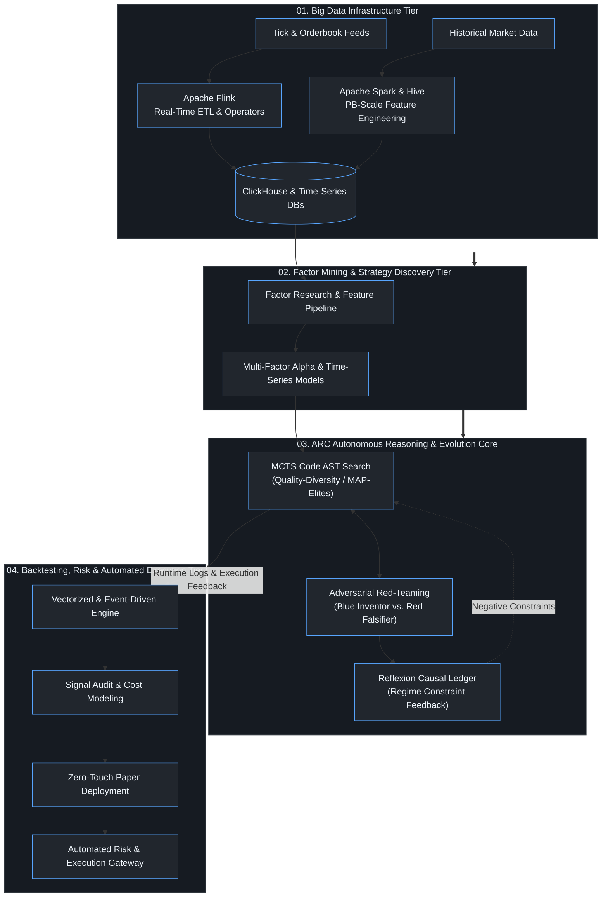

  <strong>English</strong> |
  <a href="README_CN.md">简体中文</a>

## About Me

I am a **Big Data Engineer** specializing in quantitative research infrastructure, data pipelines, and AI-driven trading systems.

Dedicated to building practical, end-to-end quantitative infrastructures that seamlessly integrate the entire research and trading lifecycle.

> 🎯 **Ultimate Vision**: Powered by Autonomous Reasoning & Control (ARC) principles, my ultimate goal is to engineer self-evolving, autonomous agent systems capable of independent exploration, continuous strategy discovery, and adaptive execution within highly complex financial environments.

### 🔄 End-to-End Quantitative & Data Architecture

```mermaid
flowchart TD
    subgraph DataTier ["01. Big Data Infrastructure Tier"]
        direction LR
        Tick["Tick & Orderbook Feeds"] --> Flink["Apache Flink<br/>Real-Time ETL & Operators"]
        KLine["Historical Market Data"] --> Spark["Apache Spark & Hive<br/>PB-Scale Feature Engineering"]
        Flink --> Store[("ClickHouse & Time-Series DBs")]
        Spark --> Store
    end

    subgraph AlphaTier ["02. Factor Mining & Strategy Discovery Tier"]
        direction LR
        Store --> FactorEngine["Factor Research & Feature Pipeline"]
        FactorEngine --> StrategyEngine["Multi-Factor Alpha & Time-Series Models"]
    end

    subgraph ARCTier ["03. ARC Autonomous Reasoning & Evolution Core"]
        direction LR
        StrategyEngine --> MCTS["MCTS Code AST Search<br/>(Quality-Diversity / MAP-Elites)"]
        MCTS <--> RedBlue["Adversarial Red-Teaming<br/>(Blue Inventor vs. Red Falsifier)"]
        RedBlue --> Reflexion["Reflexion Causal Ledger<br/>(Regime Constraint Feedback)"]
        Reflexion -. Negative Constraints .-> MCTS
    end

    subgraph ExecTier ["04. Backtesting, Risk & Automated Execution Tier"]
        direction LR
        MCTS --> Backtest["Vectorized & Event-Driven Engine"]
        Backtest --> Audit["Signal Audit & Cost Modeling"]
        Audit --> Paper["Zero-Touch Paper Deployment"]
        Paper --> LiveGate["Automated Risk & Execution Gateway"]
    end

    DataTier ==> AlphaTier ==> ARCTier ==> ExecTier
    ExecTier -. Runtime Logs & Execution Feedback .-> ARCTier

    classDef tierStyle fill:#161b22,stroke:#30363d,stroke-width:1.5px,color:#e6edf3;
    classDef nodeStyle fill:#21262d,stroke:#58a6ff,stroke-width:1px,color:#f0f6fc;
    class DataTier,AlphaTier,ARCTier,ExecTier tierStyle;
    class Tick,Flink,KLine,Spark,Store,FactorEngine,StrategyEngine,MCTS,RedBlue,Reflexion,Backtest,Audit,Paper,LiveGate nodeStyle;
```

### ⚡ Core Infrastructure & Technical Stack

  
  
  
  
  
  
  
  
  
  
  
  
  

- **Real-Time Streaming**: `Apache Flink` · `Kafka` · `Tick/Bar Streaming` · `Flink SQL` · `Large-State Checkpoint Tuning`
- **PB-Scale DWH & Batch Processing**: `Apache Spark` · `Hive` · `Hadoop` · `ODS ➔ DWD ➔ DWS Layered DWH`
- **Workflow Scheduling & Governance**: `Airflow` · `In-House Distributed Scheduler` · `1,000+ Job DAG Governance` · `SLA Monitoring & Recovery`
- **Storage, Analytics & Execution**: `ClickHouse` · `HBase` · `PostgreSQL` · `MySQL` · `Execution Gateways` · `Risk Controls`

---

## 🏆 GitHub Achievements & Activity Metrics

  

  

  
  

  

---

## What I'm Building

I am actively developing and maintaining a suite of quantitative research tools and production-grade software:

### [HyperTrade](https://github.com/Shadowell/HyperTrade)

A production-grade, governed quantitative research and strategy incubation Agent Runtime powered by the universal **ARC (Autonomous Research Core)** engine:

- **MCTS & MAP-Elites Search Engine**: Combines Monte Carlo Tree Search over strategy code ASTs with Quality-Diversity grid archiving to explore high-dimensional strategy spaces without premature convergence.
- **Adversarial Red-Teaming**: Blue Team quant agents formulate Alpha hypotheses while Red Team agents stress-test for black swan shocks, liquidity traps, and stop-loss vulnerabilities.
- **Multi-Regime Causal Attribution & Reflexion**: Deconstructs performance across market regimes (trending, volatile, range-bound) and distills structured negative constraints for continuous prompt feedback.
- **Voyager-Style Skill Distillation & Paper Trading**: Automatically distills validated code sub-functions into an immutable skill library, deploying robust candidate strategies to paper trading environments zero-touch.

### [HyperARC](https://github.com/Shadowell/HyperARC)

A universal autonomous program synthesis and AGI reasoning engine designed for the full ARC-AGI benchmark suite (ARC-AGI-1, 2, and 3 / ARC Prize 2026):

- **Universal ARC Benchmark Suite**: Standardized task models (`ARCTask`) and automated dataset loaders supporting ARC-AGI-1, 2, and 3.
- **Parallel MCTS Solver Engine**: Multi-threaded AST search engine (`HyperARCParallelMCTSEngine`) executing parallel program mutation rollouts over 2D spatial grid transformations.
- **2D Grid DSL Primitives**: Rich domain-specific primitives for spatial operations (`rotate_90`, `flip_horizontal`, `replace_color`, `crop_bounding_box`).
- **Self-Healing Harness & Exact Matching**: Scaffolding with error recovery (`HyperARCHarness`) that enforces 100% pixel-exact matching on training grid examples before predicting unseen test grids.

### [StockPro](https://github.com/Shadowell/StockPro)

A-share research and monitoring platform covering real-time market data, AI stock evaluation, factor research, strategy development, and simulation trading.

### [QuantBase](https://github.com/Shadowell/QuantBase)

Open-source quantitative research workbench focused on real market data, backtesting, paper trading, signal audit, and risk-first strategy development.

### [Alpha](https://github.com/Shadowell/Alpha)

Self-evolving A-share stock selection system combining Kronos K-line forecasting, Hermes Agent loops, and a three-pool funnel workflow.

### [配料君 (WeChat Mini Program)](#%E5%B0%8F%E7%A8%8B%E5%BA%8F%3A%2F%2F%E9%85%8D%E6%96%99%E5%90%9B%2FBxq9NHM7YIjXgxe)

A food-ingredient analysis and health-literacy mini program that I continuously operate and improve, covering data organization, product iteration, and promotion through WeChat Search.

This product is continuously operated and iterated—not a one-off demo.
