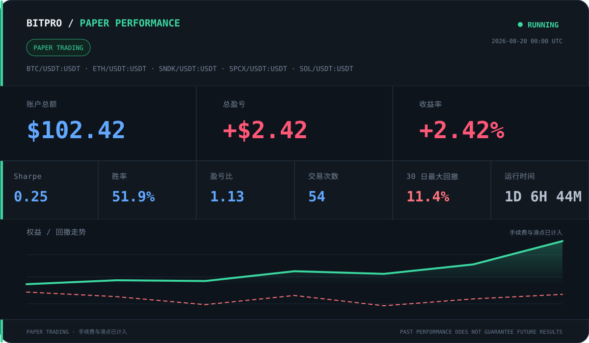

  <a href="README.md">English</a> |
  <strong>简体中文</strong>

# 冯杰

**AI Agent 与量化系统研发 · 大数据开发工程师**

目前重点构建受治理的 **AI Agent 运行时、量化研究系统和端到端 AI 工作流**。我把模型接入真实数据与工具，并通过持久状态、证据、评测、权限、人工确认和运行验证，让系统不只停留在 Prompt Demo。

这些工作的工程底座来自 **9 年大数据开发经验**，覆盖 PB 级离线数仓、大规模实时计算、任务治理、数据质量与性能优化。

[English](README.md) · [邮箱](mailto:jie.f@outlook.com)

## 我在构建什么

| 方向 | 当前工作 |
| --- | --- |
| **AI Agent 与自主研究** | 受治理运行时、工具编排、持久目标与证据、程序合成、评测和失败恢复 |
| **量化研究基础设施** | 真实行情、可复现研究、回测、Paper Trading、信号审计、风险门禁和监控 |
| **AI 产品与运营系统** | AI 视频生产、GPU/模型接入、内容运营、人工审核、测试、部署与可观测性 |

## AI Agent 系统

### [HyperTrade](https://github.com/Shadowell/HyperTrade)

面向量化研究的受治理 Agent 运行时，将开放式研究目标收敛为持久、可复查的任务。

- 持久化目标、计划、步骤、证据、预算和完成条件
- 组合 MCTS 与 MAP-Elites，进行多样化策略代码探索
- 引入红队压力测试、市场 Regime 归因和结构化否定约束
- 将研究、回测、Paper Trading 与真实效果隔离在明确的控制边界之后

### [HyperARC](https://arcprize.org/competitions/2026) · 私有研究项目

**比赛：** [ARC-AGI-2](https://www.kaggle.com/competitions/arc-prize-2026-arc-agi-2) · [ARC-AGI-3](https://www.kaggle.com/competitions/arc-prize-2026-arc-agi-3)

覆盖 ARC-AGI-1/2 程序合成与 ARC-AGI-3 交互式 Agent 实验的研究系统。

- 网格变换 DSL、候选生成、精确匹配验证与受限代码执行
- 视觉状态抽象、动作历史、技能路由与轨迹评测
- 严格区分本地诊断与官方基准结果，并保留可复现实验证据

### Agent 工程能力

`任务规划` · `Tool Calling` · `MCP` · `JSON Schema` · `状态机` · `记忆` · `评测` · `人工确认` · `失败恢复` · `审计`

## 量化研究基础设施

- [Alpha](https://github.com/Shadowell/Alpha)：开源 A 股研究系统，包含可信行情接入、可复现工作流、CI 与公开 Release
- [StockPro](https://github.com/Shadowell/StockPro)：实时 A 股研究与监控平台，覆盖数据质量、策略生命周期、回测、Paper Trading 与运行检查
- [QuantBase](https://github.com/Shadowell/QuantBase)：覆盖真实行情、Backtrader 验证、模拟交易、信号审计与风险优先研发的研究工作台
- **BitPro · 私有产品**：数字资产研究平台，覆盖交易所行情、策略版本、异步回测、仿真、受控执行与监控

### BitPro Paper 策略表现 · 快照预览

这是用于版式 Review 的截图数据预览，不是实时数据。

我把行情数据质量、计算可复现性、成本、成交明细和审计记录视为研究前提；展示研究证据，不包装未经验证的收益。

## AI 产品端到端交付

- **Zora · 私有产品**：串联故事、角色、分镜、视频生成、配音、合成、质量审核和发布的 AI 动画工作台
- **FrameLab · 私有产品**：集成模型 API、ComfyUI/GPU Worker、异步任务、存储、积分、审核、测试与部署的 AI 视频平台

我会根据能力边界选择 Codex、Cursor、GLM、Grok 等模型和工具；由我负责业务判断、需求拆解、约束、验收标准，并通过真实数据、自动化测试、运行日志和用户可见结果验证交付。

### 独立运营的微信小程序

#### 配料君

持续运营与迭代的食品配料分析与健康认知小程序，覆盖数据整理、产品迭代与微信搜一搜推广。

#### 野钓潮汐

面向钓鱼爱好者的潮汐与天气小程序，整合潮汐与气象时序数据、后端服务和移动端产品体验。

这两个小程序都是持续运营和迭代的真实产品，不是一次性 Demo。

## 大数据工程底座

| 规模 | 工程成果 |
| --- | --- |
| **600+TB/日** | 支撑 10 个国际站点分析业务的生产数据链路 |
| **1000+ 任务** | 调度迁移中的依赖、资源、灰度、SLA、回补与恢复治理 |
| **百亿事件/日** | 基于 Flink、Kafka、MySQL 与 HBase 建设实时数仓链路 |
| **PB 级数仓** | 分层建模、公共层、指标口径、跨区域同步与数据质量治理 |

大数据能力覆盖维度与分层建模、Flink/Kafka 实时计算、大状态 Checkpoint 与内存排查、调度迁移、指标治理、跨区域同步、历史回补、可观测性和失败恢复。

核心技术栈：`Flink` · `Kafka` · `Spark` · `Hive` · `Hadoop` · `HBase` · `Airflow` · `MySQL` · `PostgreSQL` · `ClickHouse` · `Python` · `Java` · `Scala`

> 雇主源代码、业务数据和内部实现细节保持保密；私有项目只展示能力与已验证结果，不公开仓库内容。

## 当前关注方向

- 具备证据、评测、记忆和安全工具调用的受治理 Agent 运行时
- 基于真实数据、可复现计算与 Paper 优先验证的量化研究
- 包含人工审核和可观测交付的 AI 视频与内容生产系统
- 支撑离线、实时、模型与 Agent 工作负载的可靠数据底座
